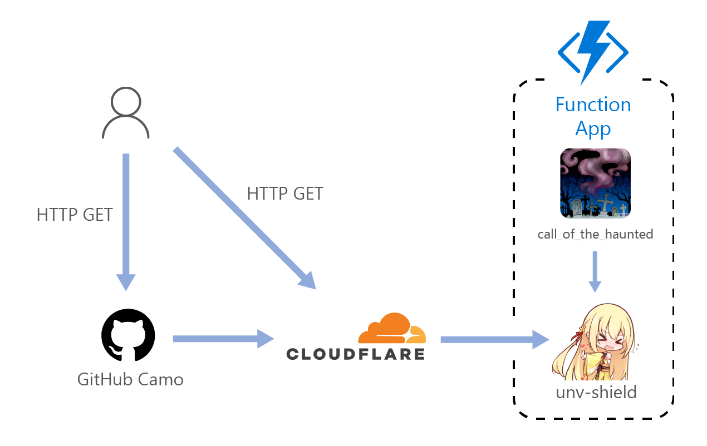

# 【幼盾】个性化图片徽章服务！


你对方形的徽章感到无聊了吗？想要定制属于自己的开源项目徽章了吗？

快来使用<b>unv-shield</b>吧！

<b>unv-shield</b>提供包含自定义图片的徽章服务，可以让你的项目主页更加个性化！


## 使用方法


```

```

把这行代码加入到你的readme中，就会显示成一个徽章，像是这样——


## 自定义

你可以通过向url传递不同的参数来自定义你的徽章: 

- `url`  
    > 样例: `url=https://avatars.githubusercontent.com/u/20064807`  
    >   
     
    把图片换掉。

- `backcolor`   
    > 样例: `backcolor=0000ff`  
    > 

    设定背景颜色。  
    默认的背景颜色会随图片改变，是自动生成的。  

- `fontcolor`  
    > 样例: `fontcolor=0000ff`  
    >   

    设定文字颜色。  
    默认的文字颜色取决于背景颜色，通常使用白字，背景颜色的亮度高时使用黑字。  

- `scale`  
    > 样例: `scale=2`  
    >   

    让你的徽章整个等比例变大。

- `txt`  
    > 样例: `txt=你好呀!`  
    >  
     
    把字换掉。

- `border`  
    > 样例: `border=4`  
    >   

    设定边距和阴影扩散范围。  
    
- `barlen`  
    > 样例: `barlen=100`  
    >   

    设定徽章的文字条的长度。  
    默认的长度是由文本决定的。  

- `size`  
    > 样例: `size=50`  
    >   
    设定徽章尺寸，但是字号不会变。

- `fontsize`  
    > 样例: `fontsize=30`  
    >   
    
    设定字体大小.

- `barradius`  
    > 样例: `barradius=999`  
    >   

    设定文本条的援交。  

- `anime`  
    > 样例: `anime=5`  
    >   

    设定文本条弹出的动画时间。

- `shadow`  
    > 样例: `shadow=0.9`  
    >   

    设定背景阴影的浓度。


## 特殊参数

- `repo`  
    将文本替换为对应Github Repo的star数量。

嗯，我先做了这一个，之后再一个一个加吧。

如果你心急如焚，也可以给这个Repo提交PR，让<b>unv-shield</b>支持更多数据源。


## 服务架构



- 服务的核心是Azure上的一个Function App<sub>(FAAS)</sub>。
- 用cloudflare做了一层HTTP缓存，可以省钱。
- 通过GitHub访问时还会过一层Camo缓存。
- 活死人的呼声是一个定时触发器，用来防止unv-shield冷启动。


## 赞助

如果你觉得<b>unv-shield</b>对你的工作或学习有所帮助，欢迎往作者的邮箱里发萝莉图片以表达谢意。
